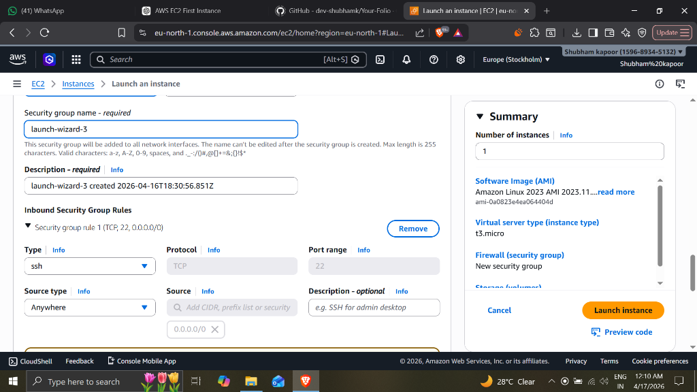
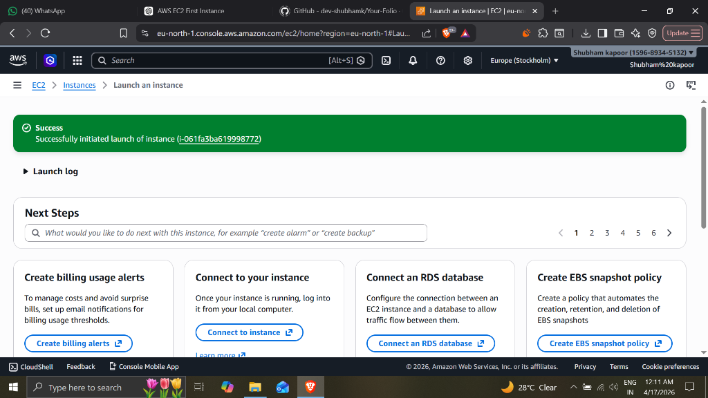
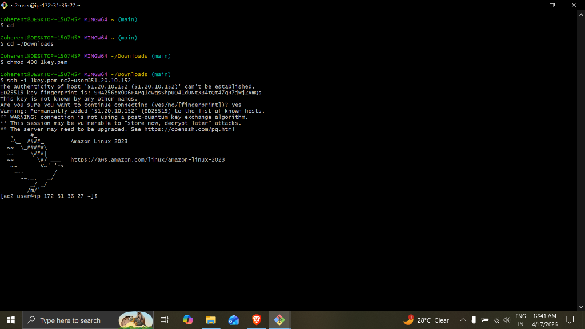

# EC2 Instance Launch and SSH Connection Practical

This repository contains the documentation and proof of completing the AWS EC2 practical. It demonstrates launching a new Amazon EC2 instance from the AWS Management Console and securely connecting to it using SSH.

## Steps Completed

### Step 1: Launching an EC2 Instance (Configuration)
In this step, I navigated to the AWS EC2 console to launch a new instance.
- **AMI used:** Amazon Linux 2023 AMI
- **Instance Type:** `t3.micro`
- **Security Group:** Created a new security group `launch-wizard-3` allowing inbound SSH traffic (`TCP` port `22`) from anywhere (`0.0.0.0/0`).

### Step 2: Instance Launch Success
After configuring all required parameters, I initiated the instance launch. The screenshot confirms the successful initiation of the EC2 instance with ID `i-061fa3ba619998772`.

### Step 3: Connecting to the Instance via SSH
Once the instance was running and had a public IP address allocated (`51.20.10.152`), I used Bash (Git Bash / MinGW64) to securely connect to it.
- **Key Pair:** Used `1key.pem` key to pass identity.
- First, I used `chmod 400 1key.pem` to set correct permissions for the private key.
- Then, I ran the ssh command `ssh -i 1key.pem ec2-user@51.20.10.152` to access the Amazon Linux 2023 shell.

---
*This README was generated based on the uploaded screenshots serving as proof of completion.*
